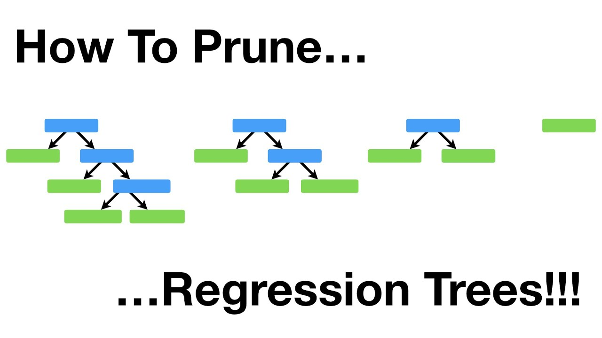

## Overview

In this note, first we will talk about the general framework of Gradient Boosting Decision Tree (GBDT), then we will focus on the different in 3 Gradient Boosting Decision Tree algorithms.

* 1.Gradient Boosting Decision Tree

    * 1.1 What is Gradient Boosting Decision Tree?
  
    * 1.2 How to train a Gradient Boosting Decision Tree?

* 2.[XGBoost](https://xgboost.readthedocs.io/en/latest/)

* 3.[LightGBM](https://lightgbm.readthedocs.io/en/latest/)

* 4.[CatBoost](https://catboost.ai)

## 1.Gradient Boosting Decision Tree

### 1.1 What is Gradient Boosting Decision Tree?

Gradient Boosting Decision Tree is an additive model,  the prediction of each observation in this model is the sum of each belonging gain of $D$ depths in $T$ trees.

Then, we can **express the predicted value as ensemble gain of every level in each tree**.

As the predicted value of each observation **start from 0**, and each tree have the **same depths (Not pruned GBDT)**. In the pruned tree, the depth of end leaf might different. 

The model can written as:

$$
\hat{y_{i}} = 0 + \sum^{T}_{t = 1} f_{t}(x_{i}) = \sum^{T}_{t = 1} f_{t}(x_{i}) = \sum^{T}_{t = 1} \sum^{D}_{d = 1} gain_{\text{{t, d, l}}} \\
\text{where} \space\space l \in \{1, 2, ..., 2^d \}, \space gain_{\text{{t, d, l}}} \space \text{might be 0 in a pruned tree}
$$

$\hat{y_{i}}$ is the predicted value of observation $i$.

$x_{i}$ is the given information of observation $i$.

$f_{t}$ is the $t_{th}$ decision tree.

$f_{t}(x_{i})$ is sum of gain in $t_{th}$ decision tree.

In $gain_{\text{{t, d, l}}}$, $t$ determine the $t_{th}$ tree, $d$ determine the $d_{th}$ depth, $l$ determine the $l_{th}$ leaf.

In each depth, one observation can only have one gain value. Hence, the predicted value in **not pruned GBDT** of observation $i$ is the sum of the $(T*D)$ gain value.

 

#### 1.1.1 Visualize the ensemble gain of Gradient Boosting Decision Tree

**Pruned means we prune the leaves of GBDT from bottom to top of each tree.**

(Image 1 from [Gradient Boosting explained demonstration](http://arogozhnikov.github.io/2016/06/24/gradient_boosting_explained.html))

**The image 1 is the pruned Gradient Boosting Decison Tree.**

The image 1 shown, observations $i$ end up with {tree 1, depth 3, leaf 2}, end up with {tree 2, depth 2, leaf 3} ..., and end up with {tree T, depth 2, leaf 2}. Assume we start from 0 of all observations, the predicted value of observation $i$ is,

$$
\begin{align}
\hat{y_{i}} &=  0 +(gain_{\text{{1, 1, 1}}} + gain_{\text{{1, 2, 1}}} + gain_{\text{{1, 3, 2}}}) + (gain_{\text{{2, 1, 2}}} + gain_{\text{{2, 2, 3}}}) + ... + (gain_{\text{{T, 1, 1}}} +gain_{\text{{T, 2, 2}}}) \\ 
&= f_{1}(x_{i}) + f_{2}(x_{i}) + ... + f_{T}(x_{i})
\end{align}
$$

In $gain_{\text{{t, d, l}}}$, $t$ determine the $t_{th}$ tree, $d$ determine the $d_{th}$ depth, $l$ determine the $l_{th}$ leaf.

The possible number of leaf in depth $d$ is $2^{d}$.

 

#### 1.1.2 Make prediction in Gradient Boosting Decision Tree

{width="60%" height="60%"}

(Image 2 from dmlc/xgboost)

As image 2 shown, the boy end up with {tree 1, depth 1, leaf 1} and {tree 2, depth 1, leaf 1}, the predicted value is,

$$
\hat{y_{boy}} = gain_{\text{{1, 1, 1}}} + gain_{\text{{2, 1, 1}}} = 2 + 0.9 = 2.9
$$

The grandpa end up with {tree 1, depth 1, leaf 2} and {tree 2, depth 1, leaf 2}, the predicted value is,

$$
\hat{y_{grandpa}} = gain_{\text{{1, 1, 2}}} + gain_{\text{{2, 1, 2}}} = -1 - 0.9 = 1.9
$$

The girl in pink dress end up with {tree 1, depth 1, leaf 1} and {tree 2, depth 1, leaf 2}, the predicted value is,

$$
\hat{y_{girl}} = gain_{\text{{1, 1, 1}}} + gain_{\text{{2, 1, 2}}} = 2 - 0.9 = 1.1
$$

 

### 1.2 How to train a Gradient Boosting Decision Tree?

Assuming we measure the training loss using total sum squared error,

$$
Loss = \sum^{n}_{i = 1} (\hat{y_{i}} - y_{i})^2
$$

Then, **we can express the training loss in term of residual**. 

**The loss in each leaf is the sum squared residuals as the predicted value start from 0**.

$$
Loss_{1, 0, 1} = \sum^{n}_{i = 1} (\hat{y_{i}} - y_{i})^2 = \sum^{n}_{i = 1} (0 - y_{i})^2 = \sum^{n}_{i = 1} (- y_{i})^2 = \sum^{n}_{i = 1} (Residual_{i, \space \text{{1,0,1}}})^2 \\
\text{where} \space\space \mathbb{E}(Residual_{i, \text{{1,0,1}}}) \neq 0 \space \text{in general}
$$

$Loss_{1, 0, 1}$ determine the loss in {tree 1, depth 0, leaf 1}.

$Residual_{i, \text{{1,0,1}}}$ determine the residual of observation $i$ as in {tree 1, depth 0, leaf 1}.

As the predicted value start from 0, the ***residuals is the negative of label in the initial leaf of first tree***.

Hence, we can **express the observation in each leaf as residual** rather than actual value. 

It's easier to compute the loss, because **the squared residual is the individual loss of observation in each tree**.

 

#### 1.2.1 How to split the leaves?

At each node, the model trying to **find the best split** that minimize the sum of loss in the left leaf and right leaf.

{width="30%" height="30%"}

(Image 3 from salford systems)

The total loss in splited leaves is:

$$
Loss_{\text{{t, (d+1), Left}}} + Loss_{\text{{t, d, Right}}}  = \sum^{L}_{l = 1} ({Residual}_{l, \text{{t, d, left}}} - \overline{{Residual}_{\text{{t, d, Left}}}})^2 + \sum^{R}_{r = 1} ({Residual}_{r, \text{{t, d, right}}} - \overline{{Residual}_{\text{{t, d, Right}}}})^2 \\
\text{where} \space\space \overline{{Residual}_{\text{{t, d, Left}}}} = \frac{1}{L}\sum^{L}_{l = 1} {Residual}_{l, \text{{t, d, left}}}, \space \overline{{Residual}_{\text{{t, d, Right}}}} = \frac{1}{R}\sum^{R}_{r = 1} {Residual}_{r, \text{{t, d, right}}}, \space L + R = N
$$

$Loss_{\text{{t, (d+1), Left}}}$ is the loss of the left leaf.

$Loss_{\text{{t, (d+1), Right}}}$ is the loss of the right leaf.

${Residual}_{l, \text{{t, d, left}}}$ is the individual residual in root node that will be split into the left leaf.

${Residual}_{r, \text{{t, d, right}}}$ is the individual residual in root node that will be split into the right leaf.

$L$ is the sample size in left leaf.

$R$ is the sample size in right leaf.

$N$ is the sample size in root node.

***The gain in each leaf is the mean of residual that split from root node.***

$$
gain_{\text{{t, d, l}}} = 
\begin{cases} 
\overline{{Residual}_{\text{{t, (d-1), Left}}}} & l \text{ is the left leaf} \\
\overline{{Residual}_{\text{{t, (d-1), Right}}}} & l \text{ is the right leaf}
\end{cases}
$$

$gain_{\text{{t, d, l}}}$ is the gain in {tree t, depth d, leaf l}.

${Residual}_{\text{{t, (d-1), Left}}}$ is the left split residual from the root node of {tree t, depth d, leaf l}.

${Residual}_{\text{{t, (d-1), Right}}}$ is the right split residual from the root node of {tree t, depth d, leaf l}.

 

#### 1.2.2 Regularization in leaves split

If we keep growing a deeper tree, the training loss won't converged until go down to 0.

$$
\sum^{L}_{l = 1} ({Residual}_{l, \text{{t, d, left}}} - \overline{{Residual}_{\text{{t, d, Left}}}})^2 + \sum^{R}_{r = 1} ({Residual}_{r, \text{{t, d, right}}} - \overline{{Residual}_{\text{{t, d, Right}}}})^2 \leq \sum^{N}_{n = 1} ({Residual}_{n, \text{{t, d, node}}} - \overline{{Residual}_{\text{{t, d, Node}}}})^2 \\
\text{where} \space\space  \overline{{Residual}_{\text{{t, d, Node}}}} = \frac{1}{N}\sum^{N}_{n = 1} {Residual}_{n, \text{{t, d, node}}}, L + R = N
$$

${Residual}_{\text{{t, d, node}}}$ is the individual residual in root node.

However, we want to minimize future prediction error, that is minimize the test error. 

Base on the bias and variance trade-off, the bias will decreased and variance increased in a deeper tree. Hence, we need to balanced the bias and variance to minimize the test error.

Consider the training error in GBDT as bias, we can approximate the variance with regularized term. And the parameters select by cross validation.

 

#### 1.2.3 The criteria to split the leaves

Then, the loss function can rewrite as:

$$
\sum^{L}_{l = 1} ({Residual}_{l, \text{{t, d, left}}} - \overline{{Residual}_{\text{{t, d, Left}}}})^2 + \Omega_{\text{{t, (d+1), Left}}} +  \sum^{R}_{r = 1} ({Residual}_{r, \text{{t, d, right}}} - \overline{{Residual}_{\text{{t, d, Right}}}})^2 + \Omega_{\text{{t, (d+1), Right}}}
$$

The split criteria is:

$$
\sum^{L}_{l = 1} ({Residual}_{l, \text{{t, d, left}}} - \overline{{Residual}_{\text{{t, d, Left}}}})^2 + \Omega_{\text{{t, (d+1), Left}}} + \sum^{R}_{r = 1} ({Residual}_{r, \text{{t, d, right}}} - \overline{{Residual}_{\text{{t, d, Right}}}})^2 + \Omega_{\text{{t, (d+1), Right}}} \\
< \sum^{N}_{n = 1} ({Residual}_{n, \text{{t, d, node}}} - \overline{{Residual}_{\text{{t, d, Node}}}})^2 + \Omega_{\text{{t, d, Node}}} \\
\text{where} \space\space \Omega_{\text{{t, (d+1), Left}}} + \Omega_{\text{{t, (d+1), Right}}} > \Omega_{\text{{t, d, Node}}} 
$$

 

#### 1.2.4 Limit the function space of tree

In order to avoid over fitting, we will set the hard threshold to limit the function space of tree in GBDT.

##### 1.Limit the depth of each tree

For a related large sample, we can set the maximum depths of each tree as 5.

The maximum number of end leaves of each tree is $2^d = 2^5 = 32$. 

Each end leaf associated with at most interaction of 5 variables. Since we search thought all the variables in each split.

For example, we split the observation into leaf {1, A} and leaf {1, B} base on {is age younger than 30?} in depth 1. Then, leaf {1, B} split into leaf {2, C} and leaf {2, D} base on {is age younger than 60?} in depth 2.

The end leaf can be:

{1, A}: age younger than 30.

{2, C}; age older and equal to 30 but younger than 60.

{2, D}; age older and equal to 60.

**Therefore, the number of interacted variable can be {1, 2, 3, 4, 5} when we set the maimum depth as 5.**

(Image 4 from Learn by Marketing)

**Limit the depth can prevent the model grown a large (deep) tree, large tree will suffer form large variance.**

It might implies people make decision base on few fators that related important, rather than consider all factors.

##### 2.Limit the number of end leaves in each tree

{width="50%" height="50%"}

(Image 5 from Josh Starmer)

In each tree, we can limit the maximum number of end leaves. 

The maximum number of end leaves in first tree is 4.

The maximum number of end leaves in second tree is 3.

The maximum number of end leaves in third tree is 2.

**Prune the number of end leaves lead to a smaller tree.**

##### 3.Minimum number of observations in one leaf

The law of large numbers (Central Limit Theorem) says that if you take samples of larger and larger size from any population, then the mean of the sampling distribution, $\mu_{\overline{x}}$ tends to get closer and closer to the true population mean, $\mu$.

(Image 6 from openstax)

The Central Limit Theorem also implies the probability density function (pdf) of the sampling distribution of means is **normally distributed regardless of the underlying distribution** of the population observations.

Consider each leaf is a sub sample of the population, we don't know the pdf of this sub sample. Our goal is to estimated the gain in each leaf. As we stated before, the gain in each leaf is the mean of residual that split from root node. 

Consider the residual in one leaf is a sample that sampling from an unknown underlying distribution. Applying Central Limit Theorem, the distribution of gain in each leaf is normally distributed.

The Central Limit Theorem also implies the **standard deviation** of the sampling distribution **decreases** **as the size of the samples** that were used to calculate the means for the sampling distribution **increases**.

**As we increased the minimum size of observations in end leaf, it decreases the standard deviation of the sampling distribution. That is decrease the variance of the gain estimation.**

 

#### 1.2.5 Strategies to grow the tree

##### 1.level-wise

(Image 7 from StackExchange)

##### 2.leaf-wise

(Image 8 from StackExchange)

